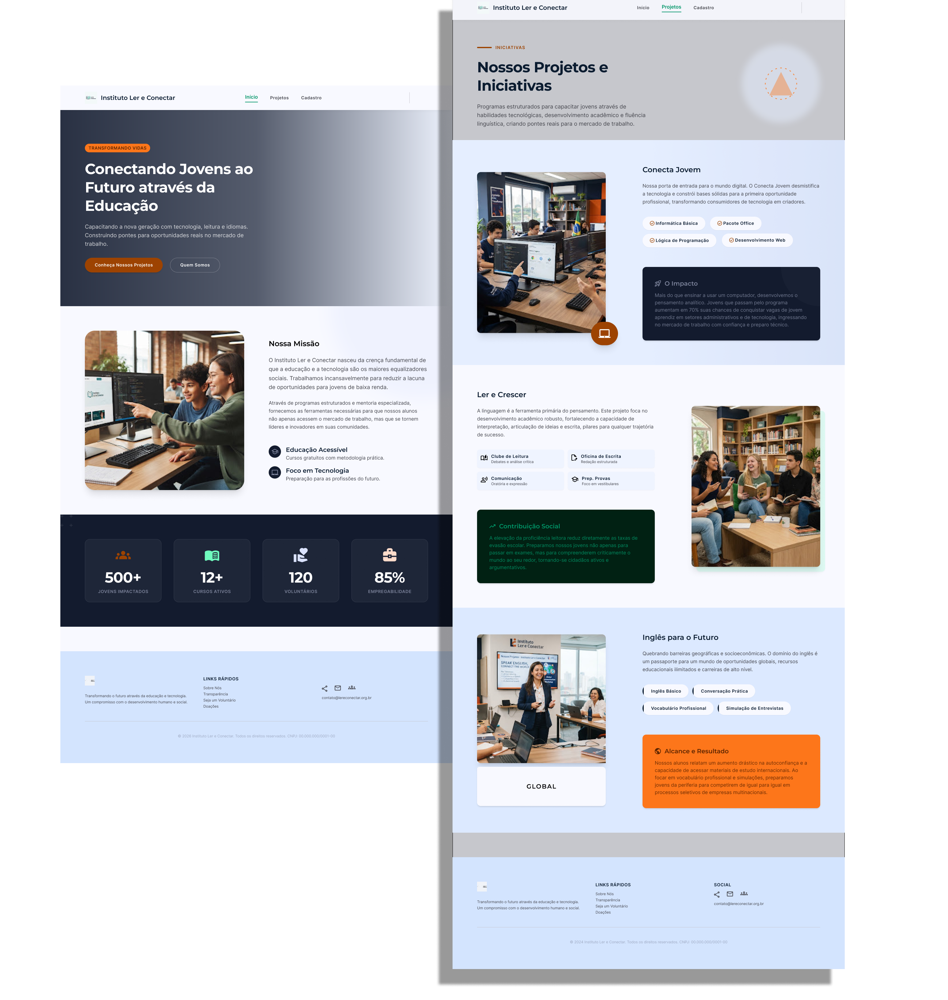

<h1 align="center">
    🚀✅ Instituto Ler e Conectar - Concluído ✅🚀
</h1>

    <a href="#-descrição-do-entregável">Descrição do Entregável</a> •
    <a href="#-sobre-o-projeto">Sobre</a> •
    <a href="#-layout">Layout</a> •
    <a href="#-como-executar-o-projeto">Como executar</a> •
    <a href="#-tecnologias">Tecnologias</a> •
    <a href="#-autor">Autor</a> •
    <a href="#-licença">Licença</a>

---

## 📄 Descrição do entregável

Este projeto foi desenvolvido como parte de uma atividade acadêmica da faculdade, com o objetivo de criar uma ONG fictícia com foco na prática de **estruturação semântica do HTML** e **regras de validação no formulário de inscrição**.

O entregável é composto pelas seguintes páginas:

- Página inicial
- Página de projetos
- Página de cadastro

---

## 💻 Sobre o projeto

O **Instituto Ler e Conectar** é um projeto desenvolvido com o objetivo de criar uma presença digital para uma instituição fictícia voltada à educação, tecnologia e capacitação de jovens.

O site apresenta informações sobre a instituição, seus principais projetos e as iniciativas oferecidas, além de disponibilizar uma página de inscrição para os interessados nos programas.

O desenvolvimento teve como foco a **estruturação semântica do HTML**, a organização adequada dos conteúdos e a aplicação de **regras de validação no formulário de inscrição**, utilizando recursos nativos do HTML.

Entre os conteúdos apresentados estão:

- A missão e os objetivos do instituto;
- Indicadores de impacto social;
- Projetos de tecnologia, leitura e idiomas;
- Informações sobre os cursos oferecidos;
- Formulário de inscrição com validações;
- Navegação entre as diferentes páginas do site.

---

## 🎨 Layout

### Página Inicial

---

## 🚀 Como executar o projeto

### Acesso online

O projeto está disponível para acesso através do site hospedado:

👉 **[Acessar o site](https://instituto-ler-e-conectar.vercel.app/index.html)**

### Executar localmente

Caso queira executar o projeto localmente:

### 1. Clone o repositório:

 		git clone https://github.com/Joao-vitorSantos08/-Instituto_Ler_e_Conectar.git

### 2. Acesse a pasta do projeto:

		cd NOME_DO_REPOSITORIO

### 3. Abra o arquivo index.html no navegador.

Também é possível utilizar uma extensão como Live Server no VS Code para executar o projeto durante o desenvolvimento.

## 🛠 Tecnologias

- HTML5
- CSS3

  ## 🦸 Autor

<a href="https://br.linkedin.com/in/Joao-vitorSantos08">
João Vitor Santos souza</a>
  
 
## 📝 Licença

Este projeto esta sobe a licença [MIT](./LICENSE).

Feito por João Vitor Santos Souza👋🏽

